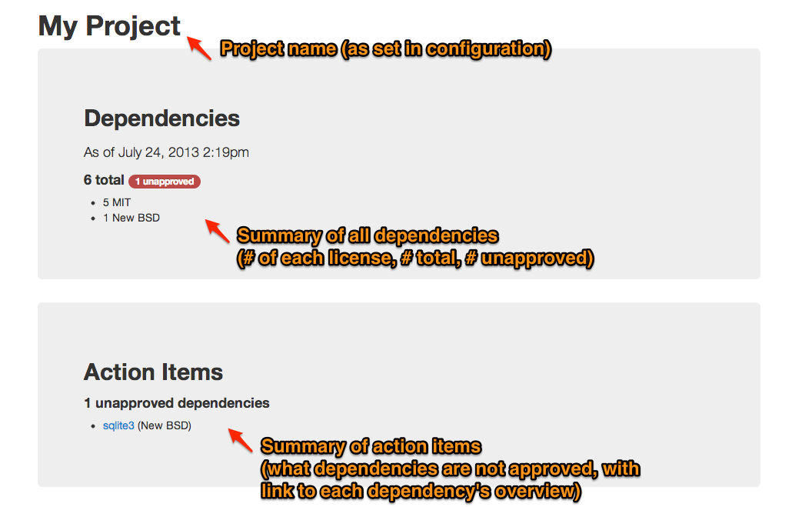
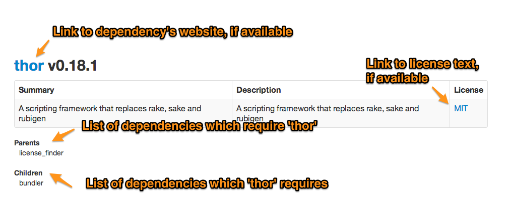

# License Finder

[](http://travis-ci.org/pivotal/LicenseFinder)
[](https://codeclimate.com/github/pivotal/LicenseFinder)

With bundler and other dependency management tools, it's easy for your project to depend on many packages.  This decomposition is nice, but managing licenses becomes difficult.  License Finder gathers info about the licenses of the packages in your project.

### Supported project types
- Ruby (+ Bundler)
- Python (+ Eggs)
- Node.js (+ Modules)

### Experimental project types 
- Java (+ Maven)
- Java (+ Gradle)
- Objective-C (+ CocoaPods)

## Installation

Add license_finder to your project's Gemfile and `bundle`:

```ruby
gem 'license_finder'
```

#### For gradle projects

You need to install the license gradle plugin: [https://github.com/hierynomus/license-gradle-plugin](https://github.com/hierynomus/license-gradle-plugin)


## Usage


License finder will generate reports of action items - i.e., dependencies that do not fall within your license "whitelist".

```sh
$ license_finder
```

(Note) If you wish to run license_finder without the progress spinner use the --quiet option.

License finder will include packages for all supported languages, as long as that language has a Gemfile/requirements.txt/package.json in the project directory.

On a brand new Rails project, you could expect license_finder to output something like the following
(assuming you whitelisted the MIT license -- see [Configuration](#configuration)):

```
Dependencies that need approval:

highline, 1.6.14, ruby
json, 1.7.5, ruby
mime-types, 1.19, ruby
rails, 3.2.8, other
rdoc, 3.12, other
rubyzip, 0.9.9, ruby
xml-simple, 1.1.1, other
```

The executable task will also write out a dependencies.db, dependencies.csv, and dependencies.html file in the doc/
directory (by default -- see [Configuration](#configuration)).

The latter two files are human readable reports that you could send to your non-technical business partners, lawyers, etc.

license_finder will also return a non-zero exit status if there are
unapproved dependencies. You could use this in a CI build, for example, to alert you whenever someone adds an
unapproved dependency to the project.

Run `license_finder help` to see other available commands.

### Manually setting licenses

When license_finder reports that a dependency's license is 'other', you should manually research what the actual
license is.  When you have established the real license, you can record it with:

```sh
$ license_finder license MIT my_unknown_dependency
```

This command would assign the MIT license to the dependency `my_unknown_dependency`.

### Manually approving dependencies

Whenever you have a dependency that falls outside of your whitelist, license_finder will tell you.
If your business decides that this is an acceptable risk, you can manually approve the dependency by using the
`license_finder approve` command.

For example, lets assume you've only
whitelisted the "MIT" license in your `config/license_finder.yml`. You then add the `awesome_gpl_gem` to your Gemfile,
which we'll assume is licensed with the `GPL` license. You then run `license_finder` and see
the gem listed in the output:

```sh
awesome_gpl_gem, 1.0.0, GPL
```

Your business tells you that in this case, it's acceptable to use this gem. You now run:

```sh
$ license_finder approve awesome_gpl_gem
```

If you rerun license_finder, you should no longer see `awesome_gpl_gem` in the output.

To record who approved the dependency and why:

```sh
$ license_finder approve awesome_gpl_gem --approver CTO --message "Go ahead"
```

### Managing license whitelist

Licenses can be added to a whitelist that tells license_finder to automatically approve dependencies using the specified licenses.
These licenses can be managed with the `license_finder whitelist` command.

To list licenses currently on the whitelist:

```sh
$ license_finder whitelist list
```

To add a licenses to the whitelist:

```sh
$ license_finder whitelist add MIT [BSD [...]]
```

To remove a licenses from the whitelist:

```sh
$ license_finder whitelist remove MIT [BSD [...]]
```

### Managing ignored Bundler groups

Bundler groups can be added to an ignore list which will prevent license_finder from evaluating their licenses.
These groups can be managed with the `license_finder ignored_bundler_groups` command.

To list currently ignored Bundler groups:

```sh
$ license_finder ignored_bundler_groups list
```

To add a group to the ignored Bundler groups:

```sh
$ license_finder ignored_bundler_groups add development
```

To remove a group from the ignored Bundler groups:

```sh
$ license_finder ignored_bundler_groups remove development
```

### Manually managing dependencies

license_finder can track dependencies that your package managers don't know about (JS libraries that don't
appear in your Gemfile/requirements.txt/package.json, etc.)

```sh
$ license_finder dependencies add MIT my_js_dep 0.1.2
```

To automatically approve an unmanaged dependency when you add it, use:

```sh
$ license_finder dependencies add MIT my_js_dep 0.1.2 --approve
```

To record who approved the dependency when you add it, use:

```sh
$ license_finder dependencies add MIT my_js_dep 0.1.2 --approve --approver CTO --message "Go ahead"
```

The version is optional.  Run `license_finder dependencies help` for additional documentation about
managing these dependencies.

license_finder cannot automatically detect when one of these dependencies has been removed from your
project, so you can use:

```sh
$ license_finder dependencies remove my_js_dep
```

### Managing project name

The HTML report generated by license_finder will have the name of your project at the top. By default, this is set to the name of your working directory. However, this can be changed using the command line:

```sh
$ license_finder project_name set 'My Project Name'
```

The changes will be reflected in the report the next time you run license_finder.


## Configuration

The first time you run license_finder it will create a default configuration file `./config/license_finder.yml`:

```yaml
---
whitelist:
#- MIT
#- Apache 2.0
ignore_groups:
#- test
#- development
dependencies_file_dir: './doc/'
project_name: My Project Name
```

By modifying this file, you can configure license_finder's behavior. Licenses in the `whitelist` will be automatically approved
and `ignore_groups` will limit which dependencies are included in your license report.  You can store the license database
and text files in another directory by changing `dependencies_file_dir`.


## HTML Report

The HTML report generated by license_finder has two sections, an overview at the top, and then a series of dependency summaries afterwards.



The individual dependency summary follows a pattern like this:



## Upgrade for pre 0.8.0 users

If you wish to cleanup your root directory you can run:

```sh
$ license_finder move
```

This will move your `dependencies.*` files to the doc/ directory and update the config.


## Compatibility

license_finder is compatible with ruby >= 1.9, and jruby.


## A note to gem authors / maintainers

For the good of humanity, please add a license to your gemspec!

```ruby
Gem::Specification.new do |s|
  s.name = "my_great_gem"
  s.license = "MIT"
end
```

And add a `LICENSE` file to your gem that contains your license text.


## Support

* Send an email to the list: [license-finder@googlegroups.com](license-finder@googlegroups.com)
* View the project backlog at Pivotal Tracker: [https://www.pivotaltracker.com/s/projects/234851](https://www.pivotaltracker.com/s/projects/234851)


## Contributing

* Fork the project
* Create a feature branch
* Make your feature addition or bug fix (with tests)
* Rebase on top of master
* Send a pull request

To successfully run the test suite, you will need node.js, python and pip installed (pip should not require sudo to work, virtualenv will work for this). If you're running the test suite with jruby, you're probably going to want to set up these environment variables:

```
JAVA_OPTS='-client -XX:+TieredCompilation -XX:TieredStopAtLevel=1' JRUBY_OPTS='-J-Djruby.launch.inproc=true'
```

## License

LicenseFinder is released under the MIT License. http://www.opensource.org/licenses/mit-license
